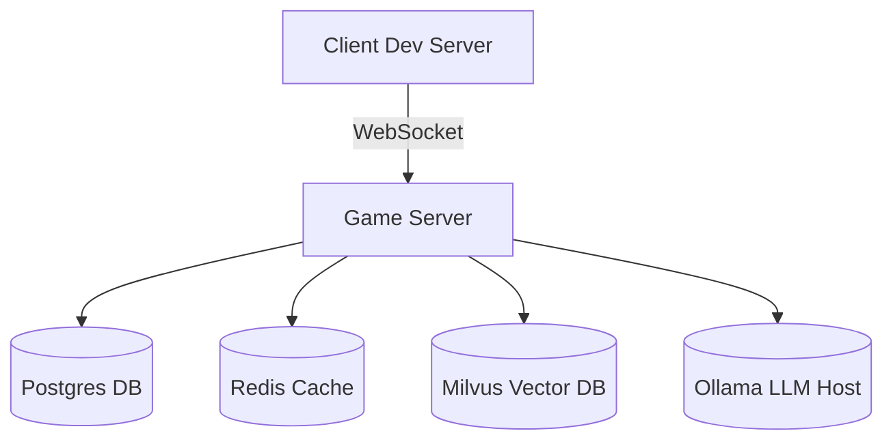

# Arcane Forge Setup Guide

This document explains how to set up the **Arcane Forge** development environment for local development and testing.

<<<<<<< HEAD
Arcane Realms is being rebuilt from scratch in LÖVE. Legacy Phaser and Node client code lives under `old/`; this guide targets the new build.

=======
>>>>>>> main
During setup you will launch the LÖVE game client, game server, and several supporting services.
The diagram below shows how they connect.



## Prerequisites

- **LÖVE 11.x** and LuaJIT (bundled with LÖVE)
- **Node.js v20.x** (LTS) and npm or yarn
- **Git** for version control
- **Docker** and **docker‑compose** for the offline AI stack
- **CPU:** Quad-core (e.g., Intel i5 or AMD Ryzen 5)
- **RAM:** 16 GB
- **GPU:** NVIDIA GTX 1660 or better with ≥6 GB VRAM (needed for large models like SDXL)
- **Operating systems:** Windows 10/11, macOS 13+, or Ubuntu 22.04+

Clone the repository:

```
git clone https://github.com/ibNez/Arcane-Realms.git
cd Arcane-Realms
```

## Install Dependencies

<<<<<<< HEAD
Install dependencies for the server (after it is implemented) and confirm LÖVE is available on your `PATH`:
=======
Install dependencies for the server and confirm LÖVE is available on your `PATH`:
>>>>>>> main

```
cd server && npm install
love --version   # verify LÖVE installation
```

Install the global TypeScript compiler if it's not already available:

```sh
npm install -g typescript
```

Install the WebSocket client library for LÖVE using [LuaRocks](https://luarocks.org):

```sh
luarocks install lua-websockets
```

The server expects certain environment variables for local development. Create `server/.env` with values like:

```env
PORT=8080
HOST=0.0.0.0
CORS_ORIGIN=http://localhost:5173
REDIS_URL=redis://localhost:6379
OLLAMA_BASE_URL=http://localhost:11434
SD_URL=http://localhost:7860
```

These commands install the TypeScript build system, networking libraries, and other runtime dependencies.

## Running the Offline AI Stack

Arcane Realms is designed to work offline with locally hosted models. Use the provided docker compose file to spin up Milvus, Postgres, Redis and Ollama. This does **not** include Whisper or Piper yet; see below.

```
# From the project root
docker compose -f ops/docker-compose.yml up -d
```

This starts the following services (ports exposed on your machine):

- **Ollama** on `http://localhost:11434` – hosts the LLM models
- **Postgres** on `localhost:5432` – game state
- **Redis** on `localhost:6379` – pub/sub and caches
- **Milvus** on `localhost:19530` – vector memory (NPC memory, creature lineages)
After the containers are up, initialize the databases:

```sh
# Create tables and seed demo rows in Postgres
docker compose exec -T postgres psql -U game -d game < ops/init-postgres.sql

# Create a Milvus collection and insert a sample vector
pip install pymilvus
python ops/init-milvus.py
```

These scripts create the basic Postgres schema and an example Milvus collection with one starter entry.

Stable Diffusion is not part of `docker-compose`. Run it separately if you plan to generate or edit images. See [stable-diffusion.md](stable-diffusion.md) for Windows installation and API options.

You should pull any required models into the Ollama container before first use. From your host:

```
ollama pull llama3.1:8b
ollama pull nomic-embed-text
```

For other models (Mistral, Gemma, etc.), change the model name accordingly. You can mount additional volumes in the `ops/docker-compose.yml` file to persist Ollama models across restarts.

### Whisper and Piper

Whisper (speech‑to‑text) and Piper (text‑to‑speech) run outside `docker-compose` and must be installed manually. After starting the servers, point the game server at them via `server/.env`.

#### faster‑whisper

```sh
python3 -m venv whisper-venv
source whisper-venv/bin/activate
pip install faster-whisper fastapi uvicorn
cat <<'EOF' > whisper_server.py
from fastapi import FastAPI, UploadFile
from faster_whisper import WhisperModel

app = FastAPI()
model = WhisperModel("base")

@app.post("/transcribe")
async def transcribe(file: UploadFile):
    segments, _ = model.transcribe(await file.read())
    return {"text": " ".join(seg.text for seg in segments)}
EOF
uvicorn whisper_server:app --host 0.0.0.0 --port 9001
```

Example systemd service (`/etc/systemd/system/faster-whisper.service`):

```ini
[Unit]
Description=Faster Whisper API
After=network.target

[Service]
Type=simple
WorkingDirectory=/opt/whisper
ExecStart=/opt/whisper/whisper-venv/bin/uvicorn whisper_server:app --host 0.0.0.0 --port 9001
Restart=on-failure

[Install]
WantedBy=multi-user.target
```

#### Piper

```sh
python3 -m pip install "piper-tts[http]"
python3 -m piper.download_voices en_US-lessac-medium
python3 -m piper.http_server -m en_US-lessac-medium --host 0.0.0.0 --port 9002
```

Example systemd service (`/etc/systemd/system/piper.service`):

```ini
[Unit]
Description=Piper TTS HTTP Server
After=network.target

[Service]
Type=simple
WorkingDirectory=/opt/piper
ExecStart=/usr/bin/python3 -m piper.http_server -m en_US-lessac-medium --host 0.0.0.0 --port 9002
Restart=on-failure

[Install]
WantedBy=multi-user.target
```

Set the following variables in `server/.env` to let the game know where these services live:

```env
WHISPER_URL=http://localhost:9001
PIPER_URL=http://localhost:9002
```

## Running the Game Locally

To start the game in development mode:

``` 
<<<<<<< HEAD
# start the server (once implemented)
=======
# start the server (express + ws)
>>>>>>> main
cd server
npm run dev

# in a separate terminal, start the LÖVE client
cd client
love .
```

- The **client** launches a native window via LÖVE.
- The **server** exposes a WebSocket on `ws://localhost:8080` for multiplayer and routes on `http://localhost:8080`.

The Forge test tools remain available at `http://localhost:5173/forge` for asset and environment authoring.

## Environment Variables

The server reads configuration from `.env`. Use the provided `.env.example` as a starting point:

```
cp server/.env.example server/.env
# then edit server/.env to change ports or DB credentials
```

**Important** – never commit your `.env` files or other secrets to the repository. The `.gitignore` includes patterns to ignore `.env`.

## Additional Tips

- Use **GitHub Codespaces** or another remote dev environment if you don’t want to run Docker locally.  
- When working with large models, allocate enough memory to Docker; some models require several GB of RAM/VRAM.  
- To tear down the AI stack:

```
docker compose -f ops/docker-compose.yml down
```

The database and vector data are persisted in the `ops/` volumes configured in `docker-compose.yml`.

For more information about the architecture, see `docs/20k-Scalability.md`.

## Troubleshooting

- **GPU not detected** – confirm `nvidia-smi` works and that your CUDA toolkit matches the driver version. Both faster‑whisper and Piper can fall back to CPU with the appropriate flags.
- **CPU models too slow** – use smaller models (e.g., `base` for Whisper or `en_US-lessac-medium` for Piper) or enable GPU acceleration.
- **Illegal instruction errors** – some binaries require AVX2; compile from source if running on older CPUs.
