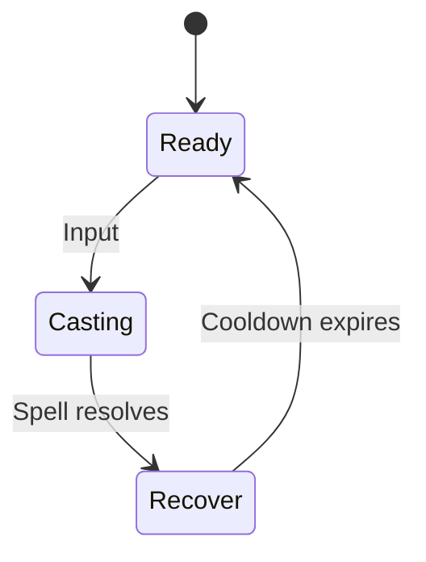

# Cleric Skills Design

## Shared Skill State Diagram

## Skill List

| Rank | Skill Name | Description | Skill Type |
| --- | --- | --- | --- |
| 1 | Heal | Single-target healing spell | Utility (Healing) |
| 2 | Smite | Ranged holy damage spell | Offense (Damage) |
| 3 | Bless | Temporary stat buff to an ally | Utility (Buff) |
| 4 | Sanctuary | Protective aura reducing incoming damage | Defense |
| 5 | Revive | Resurrect a fallen ally | Utility (Healing) |

## Level Unlocks

| Level | Skill Unlocked |
| --- | --- |
| 1 | Heal |
| 3 | Smite |
| 5 | Bless |
| 7 | Sanctuary |
| 10 | Revive |

## Skills
### Heal
- **Cooldown:** 5 s
- **Healing:** `12 + 3 * INT`
- **Range:** 6 m
- **Mana Cost:** 15
- **Critical:** Uses standard spell critical chance; critical heals restore 150% of normal healing.
- **Details:** Single-target heal; can be self-cast.

### Smite
- **Cooldown:** 6 s
- **Damage:** `15 + 4 * INT`
- **Range:** 8 m
- **Mana Cost:** 20
- **Details:** Holy bolt that damages a single enemy; deals 25% bonus damage to Undead.

### Bless
- **Cooldown:** 20 s
- **Buff:** +10% to all primary attributes
- **Range:** 6 m
- **Mana Cost:** 25
- **Duration:** 10 s
- **Details:** Enhances an ally's capabilities; does not stack with other Bless effects.

### Sanctuary
- **Cooldown:** 30 s
- **Effect:** Reduces incoming damage by 30%
- **Range:** 4 m
- **Mana Cost:** 40
- **Duration:** 8 s
- **Details:** Creates a protective aura around the target.

### Revive
- **Cooldown:** 60 s
- **Healing:** Restores target to 25% health
- **Range:** 4 m
- **Mana Cost:** 60
- **Details:** Brings a fallen ally back to life at reduced health.

## Open Questions
- Should Clerics have additional healing and support abilities?

## Acceptance Criteria
- Each skill follows the shared state diagram and respects its cooldown.
- Damage/healing formulas are implemented exactly as specified.
- Casting animations lock out movement during Casting phase.
- Unit tests cover cooldown enforcement and formula calculations.
