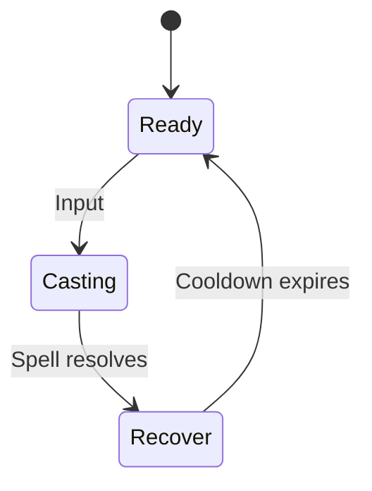

# Cleric Skills Design

## Shared Skill State Diagram

## Skill List

| Rank | Skill Name | Description | Skill Type |
| --- | --- | --- | --- |
| 1 | Heal | Single-target healing spell | Utility (Healing) |

> **TODO:** Flesh out additional cleric skills and progression tiers beyond Rank 1.

## Skills
### Heal
- **Cooldown:** 5 s
- **Healing:** `12 + 3 * INT`
- **Details:** Single-target heal; can be self-cast.
> **TODO:** Define casting range and mana cost for Heal.

## Open Questions
- What is the casting range for Heal?
- Should Clerics have additional healing and support abilities?
- Do critical hits apply to healing spells?
> **TODO:** Decide whether healing can crit and document the formula if so.

## Acceptance Criteria
- Each skill follows the shared state diagram and respects its cooldown.
- Damage/healing formulas are implemented exactly as specified.
- Casting animations lock out movement during Casting phase.
- Unit tests cover cooldown enforcement and formula calculations.
