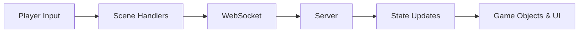

# Client Architecture

## Scene Structure
- **TestScene** – sandbox for skill and UI experiments. It binds movement and skill keys, toggles the in-game DevConsole with the backtick key, and wires up chat and skill cooldown UI.
- **PlayScene** – main gameplay loop. It handles pointer-based movement and shooting, creates the ChatPanel, and connects to the server over WebSockets to sync other players and enemies.

## UI Components
- **ChatPanel** – DOM overlay shown with `C`; captures text input and sends it back to the scene via a callback.
- **SkillBar** – bottom-center HUD that displays skill slots and cooldown fill animations.
- **DevConsole** – lightweight log viewer toggled with the backtick key; scenes can call `getDevConsole()` to show it.

Scenes create these components and coordinate them—for example, TestScene disables pointer actions while ChatPanel is open and triggers SkillBar cooldowns when spells cast.

## Input → Network → Game Objects

## Extending the Client
### Adding a Scene
1. Create a new class in `client/src/scenes` extending `Phaser.Scene`.
2. Import and register it in the game config (`client/src/main.ts`).
3. Reuse helpers like `ChatPanel`, `SkillBar`, or `getDevConsole` as needed.

### Adding a Skill
1. Declare a keybinding and add a slot in `SkillBar` (`TestScene.create` shows the pattern).
2. Implement the ability (e.g., `castMagicMissile` or `castArcaneNova`) and trigger cooldowns through `SkillBar`.
3. For networked skills, send a message through the scene's WebSocket handler similar to other actions.
