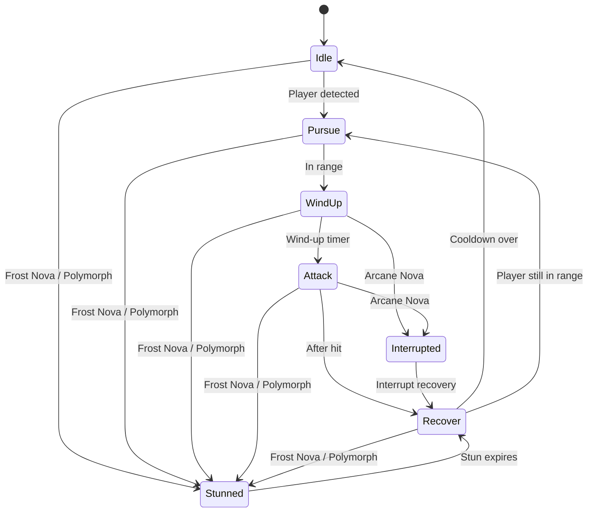

# Enemy FSM Design

## State Diagram

> **TODO:** Describe how the FSM handles multiple players targeting the same enemy.

### Crowd Control
- **Stunned:** Triggered by skills like *Frost Nova* or *Polymorph*. The enemy is
  immobile and unable to act until the effect ends, then transitions to
  **Recover**.
- **Interrupted:** Caused by knockback or counter skills such as *Arcane Nova*.
  The current **WindUp** or **Attack** is canceled and the enemy briefly enters
  **Interrupted** before moving to **Recover**.

## Cooldowns
- **Wind-up:** 0.5 s telegraph before attack.
- **Attack:** Instant damage frame.
- **Recover:** 1.0 s before returning to Idle or Pursue.

## Damage Formula
`damage = baseDamage * (1 + 0.1 * enemyLevel)`

## Open Questions
- Should different enemy types override the default timers?
- Do ranged enemies share the same state flow or branch after Pursue?
> **TODO:** Define separate behaviors for ranged and special enemy types.

## Acceptance Criteria
- Enemy state transitions follow the diagram above and are driven by timers and player proximity.
- Cooldowns are configurable per enemy type.
- Damage calculation uses the specified formula with unit tests covering at least Idle→Attack→Recover flow.
- Telegraphed attack visuals play during Wind-up phase.
