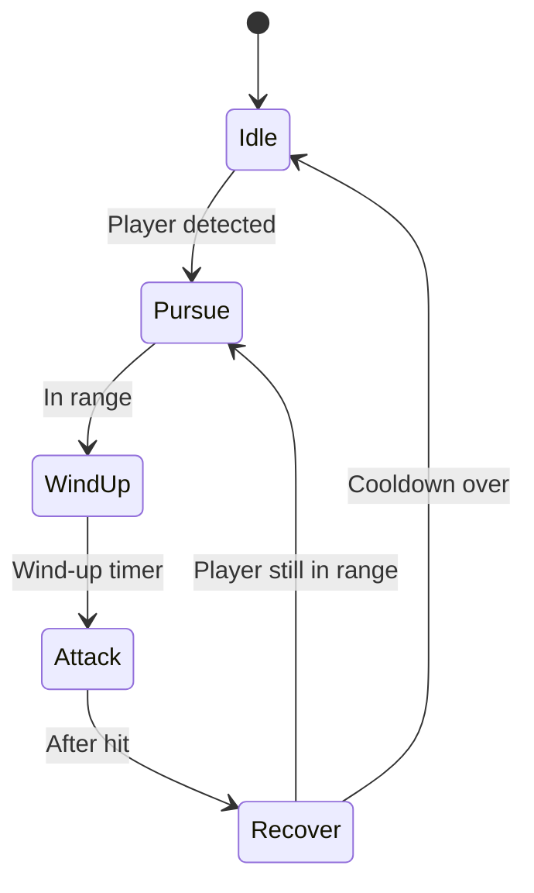

# Enemy FSM Design

## State Diagram

## Threat Mechanics
- Each enemy tracks a threat value for every nearby player.
- **Damage:** Threat increases by the exact damage dealt to the enemy.
- **Proximity:** Players within melee range gain a small, steady threat per second.
- The enemy targets the player with the highest accumulated threat.
- **Tie‑breaking:** When threat values match, the closest player is targeted; if still tied, the one who first generated threat retains aggro.

## Cooldowns
- **Wind-up:** 0.5 s telegraph before attack.
- **Attack:** Instant damage frame.
- **Recover:** 1.0 s before returning to Idle or Pursue.

## Damage Formula
`damage = baseDamage * (1 + 0.1 * enemyLevel)`

## Open Questions
- Should different enemy types override the default timers?
- How are interrupts or stuns represented in the state machine?
- Do ranged enemies share the same state flow or branch after Pursue?
> **TODO:** Define separate behaviors for ranged and special enemy types.

## Acceptance Criteria
- Enemy state transitions follow the diagram above and are driven by timers and player proximity.
- Cooldowns are configurable per enemy type.
- Damage calculation uses the specified formula with unit tests covering at least Idle→Attack→Recover flow.
- Telegraphed attack visuals play during Wind-up phase.
