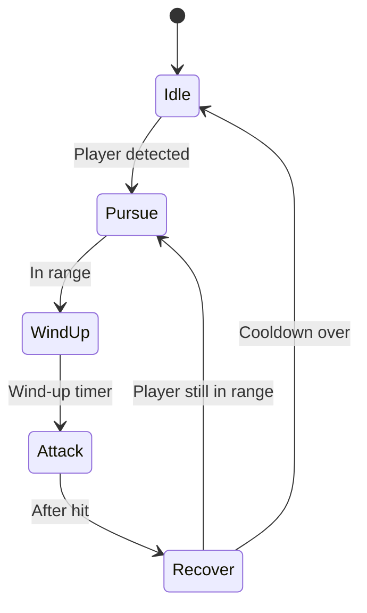

# Enemy FSM Design

## State Diagram


> **TODO:** Describe how the FSM handles multiple players targeting the same enemy.

## Cooldowns
Default timers apply to enemies that do not specify their own values:

- **Wind-up:** 0.5 s telegraph before attack.
- **Attack:** Instant damage frame.
- **Recover:** 1.0 s before returning to Idle or Pursue.

### Per-enemy configuration
Each enemy type can override these durations through its configuration. Timers
are expressed in seconds and are loaded when the enemy instance spawns.

```json
{
  "goblin": {
    "windUp": 0.2,
    "attack": 0.0,
    "recover": 0.8
  },
  "stoneGolem": {
    "windUp": 1.2,
    "attack": 0.3,
    "recover": 2.0
  }
}
```

## Damage Formula
`damage = baseDamage * (1 + 0.1 * enemyLevel)`

## Open Questions
- How are interrupts or stuns represented in the state machine?
- Do ranged enemies share the same state flow or branch after Pursue?
> **TODO:** Define separate behaviors for ranged and special enemy types.

## Acceptance Criteria
- Enemy state transitions follow the diagram above and are driven by timers and player proximity.
- Cooldowns are configurable per enemy type.
- Damage calculation uses the specified formula with unit tests covering at least Idle→Attack→Recover flow.
- Telegraphed attack visuals play during Wind-up phase.
