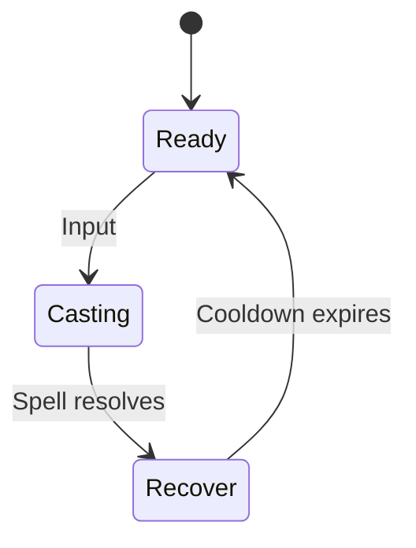

# Mage Skills Design

## Overview
The Mage class is a ranged spellcaster focused on elemental damage, crowd control, and battlefield manipulation. Mages rely on Intelligence (INT) for spell power and have a diverse toolkit ranging from quick-casting missiles to powerful area-of-effect spells. All mage abilities consume mana and follow a standardized casting system with cooldowns.

### Class Characteristics
- **Primary Attribute:** Intelligence (INT) - affects all spell damage and healing
- **Resource:** Mana – consumed by all abilities.
  - Regenerates at 1% of maximum per second.
  - Doubles to 2% per second while out of combat.
  - Casting a spell or taking damage pauses regeneration for 3 seconds.
- **Range:** Primarily ranged combat with some point-blank area effects
- **Role:** Damage dealer with utility and crowd control options

### Scaling and Critical Hits
- **INT Scaling:** Damage and healing for all mage spells follow `base + coefficient * INT` formulas. Each skill's coefficient is listed in its description.
- **Critical Chance:** Spells have a baseline 5% chance to critically hit.
- **Critical Multiplier:** Critical hits deal 150% of the INT-scaled result and apply after all additive modifiers.

## Shared Skill State Diagram

During the **Recover** state, new skill inputs are ignored rather than queued.
This forces the player to wait until the skill fully recovers before executing
another ability, preventing accidental buffering and preserving reaction
windows for counterplay.

## Skill List

| Rank | Skill Name | Description | Skill Type |
| --- | --- | --- | --- |
| 1 | Fireball / Pyroblast | High burst/fire damage | Offense (Damage) |
| 2 | Frost Nova / Ice Blast | AoE freeze/root crowd control | Control |
| 3 | Arcane Missiles | Rapid magical projectile attacks | Offense (Damage) |
| 4 | Summon Elemental / Pet | Summons helper elemental minions | Utility / Control |
| 5 | Blink / Teleportation | Instant repositioning/mobility spell | Mobility |
| 6 | Meteor / Comet Call | Massive AoE fire damage with cinematic effect | Offense (Damage) |
| 7 | Polymorph / Mind Control | Crowd control, incapacitate enemies | Control |
| 8 | Mana Shield / Barrier | Damage absorption using mana | Defense |
| 9 | Chain Lightning / Thunderbolt | Bouncing lightning spell | Offense (Damage) |
| 10 | Time Manipulation | Slow enemies or haste allies | Control / Utility |

> **TODO:** Outline progression tiers and how new mage skills unlock over levels.

## Skills

### Magic Missile
- **Cooldown:** 1.5 s
- **Damage:** `10 + 2 * INT`
- **Range:** 8 m
- **Mana Cost:** 10
- **Cast Time:** 1.0 s
- **Details:** Fires a homing projectile at the target. Cannot miss once cast.
> **TODO:** Describe projectile speed and interaction with obstacles.

### Fireball
- **Cooldown:** 3.0 s
- **Damage:** `25 + 3 * INT`
- **Range:** 10 m
- **Area:** 2 m radius explosion
- **Mana Cost:** 25
- **Cast Time:** 2.0 s
- **Details:** High damage fire projectile that explodes on impact, dealing area damage.

### Frost Nova
- **Cooldown:** 12 s
- **Damage:** `8 + 1 * INT`
- **Range:** Self-centered
- **Area:** 5 m radius
- **Mana Cost:** 30
- **Cast Time:** 1.5 s
- **Status Effect:** Freeze for 3 seconds
- **Details:** AoE freeze that immobilizes all enemies within range.

### Arcane Missiles
- **Cooldown:** 6 s
- **Damage:** `6 + 1.5 * INT` per missile (5 missiles)
- **Range:** 12 m
- **Mana Cost:** 35
- **Cast Time:** 3.0 s (channeled)
- **Interruption Threshold:** Channel ends if the mage moves or a single hit deals ≥10% of max health.
- **Partial Damage:** Fires one missile every 0.6 s (max 5). If interrupted early, `totalDamage = floor(channelTime / 0.6) × (6 + 1.5 × INT)`.
- **Details:** Rapid-fire magical projectiles.

### Summon Elemental
- **Cooldown:** 45 s
- **Range:** 5 m
- **Mana Cost:** 80
- **Cast Time:** 3.0 s
- **Duration:** 60 s
- **Details:** Summons a fire elemental with 50 + 5 * INT health that fights alongside you.

### Blink
- **Cooldown:** 8 s
- **Range:** 6 m
- **Mana Cost:** 20
- **Cast Time:** Instant
- **Details:** Instantly teleports to target location within range. Cannot pass through walls.

### Meteor
- **Cooldown:** 20 s
- **Damage:** `50 + 5 * INT`
- **Range:** 15 m
- **Area:** 4 m radius
- **Mana Cost:** 100
- **Cast Time:** 4.0 s
- **Details:** Massive area damage with a delay. Area is marked before impact.

### Polymorph
- **Cooldown:** 15 s
- **Range:** 8 m
- **Mana Cost:** 40
- **Cast Time:** 2.0 s
- **Duration:** 8 s
- **Details:** Transforms target enemy into a harmless sheep. Breaks on damage.

### Mana Shield
- **Cooldown:** 30 s
- **Range:** Self
- **Mana Cost:** 50
- **Cast Time:** 1.0 s
- **Duration:** 20 s
- **Details:** Absorbs `30 + 2 * INT` damage using mana instead of health (2 mana per damage).
> **TODO:** Define recharge mechanics and interactions with other defensive buffs.

### Chain Lightning
- **Cooldown:** 10 s
- **Damage:** `20 + 2.5 * INT` (decreases by 25% per jump)
- **Range:** 10 m
- **Targets:** Up to 5 enemies
- **Mana Cost:** 60
- **Cast Time:** 1.5 s
- **Details:** Lightning bounces between nearby enemies, dealing reduced damage with each jump.

### Time Manipulation
- **Cooldown:** 25 s
- **Range:** 8 m
- **Area:** 6 m radius
- **Mana Cost:** 70
- **Cast Time:** 2.5 s
- **Duration:** 10 s
- **Details:** Slows enemy movement and attack speed by 50%, or increases ally speed by 30%.

### Arcane Nova
- **Cooldown:** 8 s
- **Damage:** `15 + 1.5 * INT`
- **Range:** Self-centered
- **Area:** 4 m radius
- **Mana Cost:** 45
- **Cast Time:** 1.0 s
- **Details:** Point-blank area burst with brief knockback.

## Design Principles
- **Skill Diversity:** Each skill should serve a distinct tactical purpose
- **Resource Management:** Mana costs should create meaningful choices
- **Risk/Reward:** Longer cast times for more powerful effects
- **Counterplay:** All crowd control effects should have counterplay options
- **Scaling:** All abilities scale with INT to maintain relevance

## Open Questions
- Should there be spell resistance mechanics for certain enemies?
- What happens when a mage runs out of mana mid-cast?
- Should area spells have friendly fire considerations?
- How should line-of-sight affect targeted spells?
> **TODO:** Decide if terrain and obstacles block spells and include LOS checks in design.

## Acceptance Criteria
- Each skill follows the shared state diagram and respects its cooldown
- Damage/healing formulas are implemented exactly as specified
- Casting animations lock out movement during Casting phase
- Mana costs are properly deducted and validated before casting
- Area effects properly detect and affect all valid targets
- Status effects (freeze, polymorph) are applied with correct durations
- Channeled abilities can be interrupted by movement or taking damage
- Line-of-sight checks are performed for targeted abilities
- Unit tests cover:
  - Cooldown enforcement and formula calculations
  - Mana cost validation and deduction
  - Status effect application and duration
  - Area detection and damage distribution
  - Interruption mechanics for channeled spells
