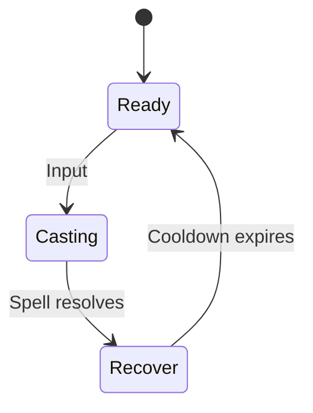

# Mage Skills Design

## Shared Skill State Diagram

## Skill List

| Rank | Skill Name | Description | Skill Type |
| --- | --- | --- | --- |
| 1 | Fireball / Pyroblast | High burst/fire damage | Offense (Damage) |
| 2 | Frost Nova / Ice Blast | AoE freeze/root crowd control | Control |
| 3 | Arcane Missiles | Rapid magical projectile attacks | Offense (Damage) |
| 4 | Summon Elemental / Pet | Summons helper elemental minions | Utility / Control |
| 5 | Blink / Teleportation | Instant repositioning/mobility spell | Mobility |
| 6 | Meteor / Comet Call | Massive AoE fire damage with cinematic effect | Offense (Damage) |
| 7 | Polymorph / Mind Control | Crowd control, incapacitate enemies | Control |
| 8 | Mana Shield / Barrier | Damage absorption using mana | Defense |
| 9 | Chain Lightning / Thunderbolt | Bouncing lightning spell | Offense (Damage) |
| 10 | Time Manipulation / Slow / Haste | Slow enemies or haste allies | Control / Mobility |

## Skills
### Magic Missile
- **Cooldown:** 1.5 s
- **Damage:** `10 + 2 * INT`
- **Details:** Fires a homing projectile at the target.

### Arcane Nova
- **Cooldown:** 8 s
- **Damage:** `15 + 1.5 * INT` to all enemies in radius 4 m.
- **Details:** Point-blank area burst with brief knockback.

### Heal
- **Cooldown:** 5 s
- **Healing:** `12 + 3 * INT`
- **Details:** Single-target heal; can be self-cast.

## Open Questions
- Should skills queue if activated during Recover?
- What is the casting range for Heal?
- Do critical hits apply to spells?

## Acceptance Criteria
- Each skill follows the shared state diagram and respects its cooldown.
- Damage/healing formulas are implemented exactly as specified.
- Casting animations lock out movement during Casting phase.
- Unit tests cover cooldown enforcement and formula calculations.
