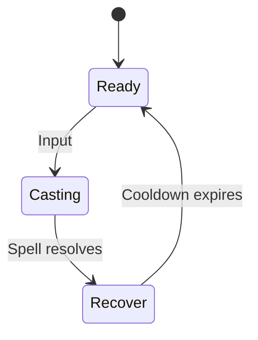

# Mage Skills Design

## Shared Skill State Diagram

## Skills
### Magic Missile
- **Cooldown:** 1.5 s
- **Damage:** `10 + 2 * INT`
- **Details:** Fires a homing projectile at the target.

### Arcane Nova
- **Cooldown:** 8 s
- **Damage:** `15 + 1.5 * INT` to all enemies in radius 4 m.
- **Details:** Point-blank area burst with brief knockback.

### Heal
- **Cooldown:** 5 s
- **Healing:** `12 + 3 * INT`
- **Details:** Single-target heal; can be self-cast.

## Open Questions
- Should skills queue if activated during Recover?
- What is the casting range for Heal?
- Do critical hits apply to spells?

## Acceptance Criteria
- Each skill follows the shared state diagram and respects its cooldown.
- Damage/healing formulas are implemented exactly as specified.
- Casting animations lock out movement during Casting phase.
- Unit tests cover cooldown enforcement and formula calculations.
